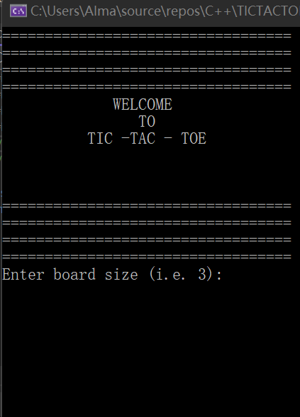
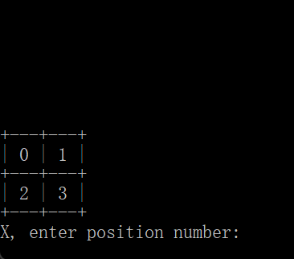
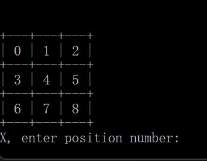
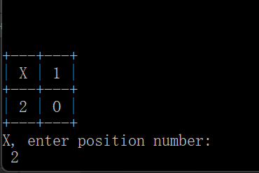
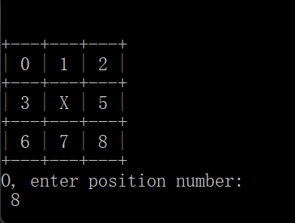
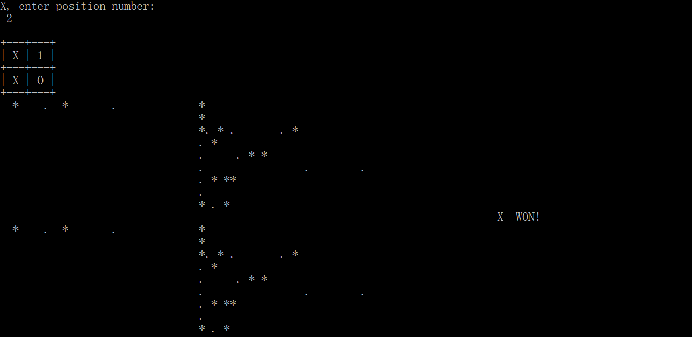
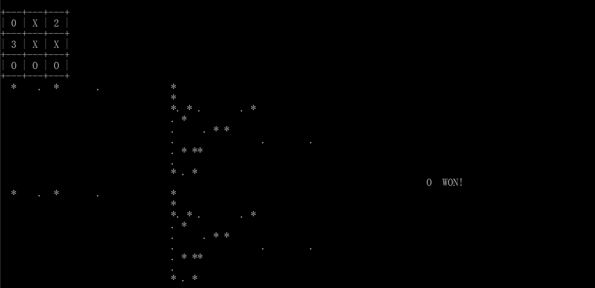
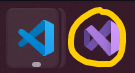

# Overview

Hello everyone! This C++ program was really fun to build and I must admit it left me with an increasedd curiosity to what can actually be built with C++! 

When learning a new programming language, one can have a hard time picking what to build. Let's be honest, we could build anything we want! However, simple projects like TIC - TAC-TOE, can help you get a good experience with applying Object Oriented Programming skills, working with Classes, Functions, and all-that-jazz. My purpose for this program was to be able to apply what was previously mentioned into a language that is not Python; and C++ was next on my list to tackle. 

Also, don't make my mistake by trying to shoot for the moon when it comes to learning a new programming language! 

If you know how to play TIC TAC TOE, you're on a good road towards understanding the rules of the game. However, playing it on a digital terminal from some randome programmer may have you wondering *"How do you start playing this version of the game?!"*

Whatch the demo video below to see how to play!

[Software Demo Video](https://www.youtube.com/watch?v=4yTTwt2La68)

# Development Environment

Tools used for this program were:
1. Microsoft Visual Studio 
1. GitHub

Programming Languages used:
1. C++

# Step-by-step Game
1. WELCOME MESSAGE

    

2. Pick Grid size - for a 2x2 grid, you just type *"2"*. The bigger the grid, the longer you play.

3. Insert number to play X/O.

4. Winner message displayed with nice ASCII decor!

# Useful Websites

Some of my favorite sources for building this program are listed below. The video resoruces to build the program logic are written at the bottom of the main source mail called *TICTACTOE.cpp* - see the code section of this GitHub repository.
* [CPLUSPLUS.com](http://www.cplusplus.com/doc/tutorial/) - 
This site will help you understand the proper usage of header files, classes, and syntax.
* [DevDocs.IO](https://devdocs.io/cpp/) - This site has a main focus on proper syntax and provides clean and organized examples.

* [Microsoft Visual Studio](https://docs.microsoft.com/en-us/cpp/?view=msvc-170) - If like me, your IDE of choice is Microsoft Visual Studio (the purple icon IDE that is NOT to be confused with the blue Visual Studio Code IDE), this website can help you understand how to better use your IDE when using programming languages like C++, C, or C#. They even have tutorials, and they're really cool to experiment with!

The purple icon is Microsoft Visual Studio:

# Future Work

Moving forward, a few things I'd like to implement to this game or any future C++ program I create are:

* Load images and sounds into C++.
* Learn how to build a user-friendly GUI.
* Have ASCII symbols be Sprites.
